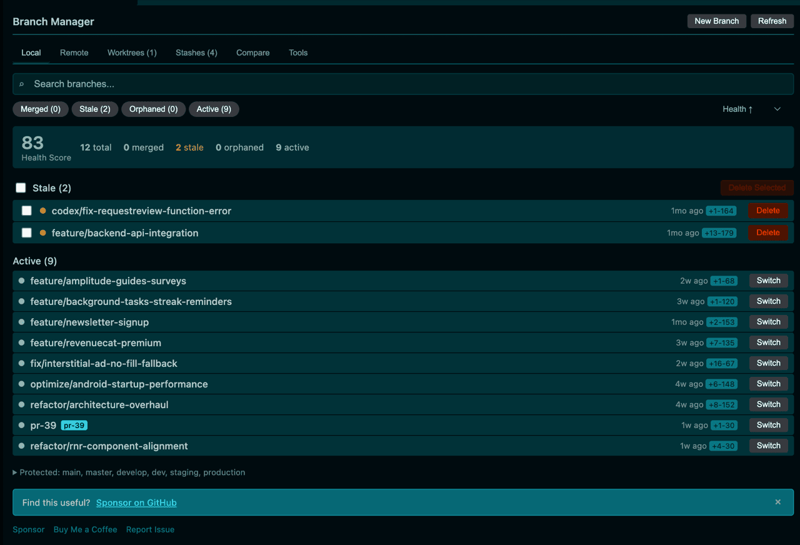
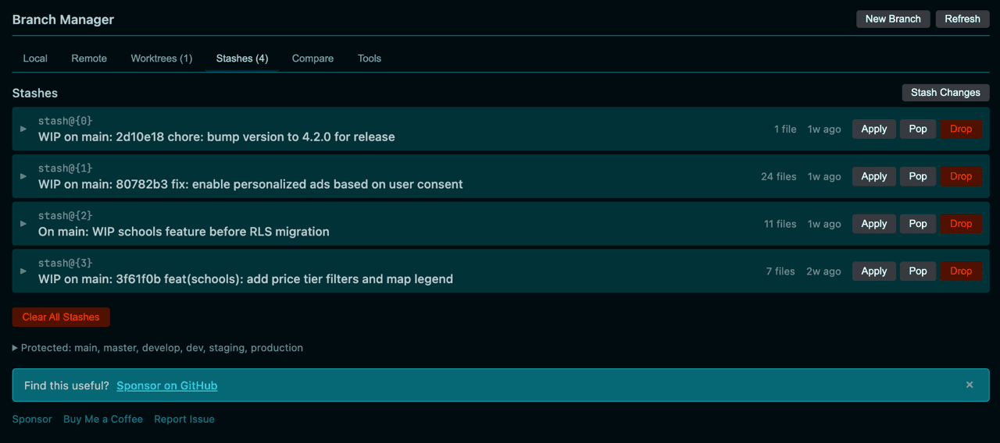

# Git Branch Manager - Clean & Organize

> **Love this extension?** [Become a sponsor](https://github.com/sponsors/YonasValentin) to support ongoing development and new features.

---

## Stop Wasting Time on Branch Cleanup

How many old branches are cluttering your repository right now? **Git Branch Manager** gives you a complete dashboard to visualize, organize, and clean up your Git branches in seconds.

### Why Developers Love It

- **Branch Health Scoring** — Every branch gets a score (0-100) so you instantly know what needs attention
- **One-Click Cleanup** — Select multiple branches and delete them all at once
- **Smart Detection** — Automatically identifies merged, stale, and orphaned branches
- **Protected Branches** — Your main branches are always safe from accidental deletion

---

## Features at a Glance

### Branch Dashboard
See all your branches organized by status: **Merged**, **Stale**, **Orphaned**, and **Active**. Each branch shows its age, commit count, and health score.

### Stash Management
Never lose work again. View, apply, pop, or drop stashes with a clean interface.

### Worktree Support
Work on multiple branches simultaneously without stashing. Create, open, and manage Git worktrees directly from VS Code.

### Branch Templates
Create branches with consistent naming conventions:
- `feature/add-user-auth`
- `bugfix/fix-login-error`
- `hotfix/critical-payment-fix`

---

## Quick Start

1. **Install** the extension from VS Code Marketplace
2. **Open** a Git repository in VS Code
3. **Click** the branch icon in your status bar (or run `Git Branch Manager: Show Branch Cleaner`)
4. **Clean up** merged and stale branches with one click

**Keyboard Shortcuts:**
| Action | Mac | Windows/Linux |
|--------|-----|---------------|
| Open Dashboard | `Cmd+Shift+G Cmd+Shift+C` | `Ctrl+Shift+G Ctrl+Shift+C` |
| Create Branch | `Cmd+Shift+G Cmd+Shift+N` | `Ctrl+Shift+G Ctrl+Shift+N` |

---

## All Commands

| Command | Description |
|---------|-------------|
| `Git Branch Manager: Show Branch Cleaner` | Open the main dashboard |
| `Git Branch Manager: Quick Clean Merged Branches` | Delete all merged branches instantly |
| `Git Branch Manager: Create Branch from Template` | Create a branch with consistent naming |
| `Git Branch Manager: Clean Remote Branches` | Clean merged remote branches |
| `Git Branch Manager: Manage Worktrees` | View and manage Git worktrees |
| `Git Branch Manager: Create Worktree` | Create a worktree from any branch |
| `Git Branch Manager: Quick Stash` | Stash current changes |
| `Git Branch Manager: Pop Latest Stash` | Apply and remove the latest stash |

---

## Configuration

Customize the extension to fit your workflow:

| Setting | Default | Description |
|---------|---------|-------------|
| `gitBranchManager.daysUntilStale` | `30` | Days before a branch is flagged as stale |
| `gitBranchManager.protectedBranches` | `["main", "master", "develop", "dev", "staging", "production"]` | Branches that can never be deleted |
| `gitBranchManager.confirmBeforeDelete` | `true` | Show confirmation before deleting |
| `gitBranchManager.showNotifications` | `true` | Notify when branches need cleanup |

---

## Frequently Asked Questions

<strong>Does this delete remote branches?</strong>

Only through the **Remote** tab with explicit confirmation. Local deletions never affect your remote repository.

<strong>Can I undo a branch deletion?</strong>

Git doesn't make branch deletion easily reversible—that's why we show confirmation dialogs. If you need to recover a deleted branch, use `git reflog` to find the commit and recreate it.

<strong>Why doesn't my branch show up?</strong>

Protected branches (main, master, develop, etc.) are hidden from the cleanup list. You can customize protected branches in settings.

<strong>What are orphaned branches?</strong>

Local branches whose remote tracking branch has been deleted. These are usually safe to clean up.

---

## Requirements

- VS Code 1.74.0 or higher
- Git installed and accessible from command line
- An open Git repository

---

## Changelog

See [CHANGELOG.md](CHANGELOG.md) for version history.

---

## Found a Bug?

[Open an issue on GitHub](https://github.com/yonasvalentin/git-branch-manager-pro/issues)

---

## Support Development

This extension is **free and open source**. If it saves you time, consider supporting its development:

### Sponsor on GitHub (Recommended)
GitHub Sponsors is the best way to support ongoing development. Sponsors get priority support and help fund new features.

### Other Ways to Help
- [Leave a review](https://marketplace.visualstudio.com/items?itemName=YonasValentinMougaardKristensen.git-branch-manager-pro&ssr=false#review-details) — helps others discover the extension
- [Report issues](https://github.com/yonasvalentin/git-branch-manager-pro/issues) — help improve quality
- [Buy me a coffee](https://www.buymeacoffee.com/YonasValentin) — one-time support

---

MIT License
